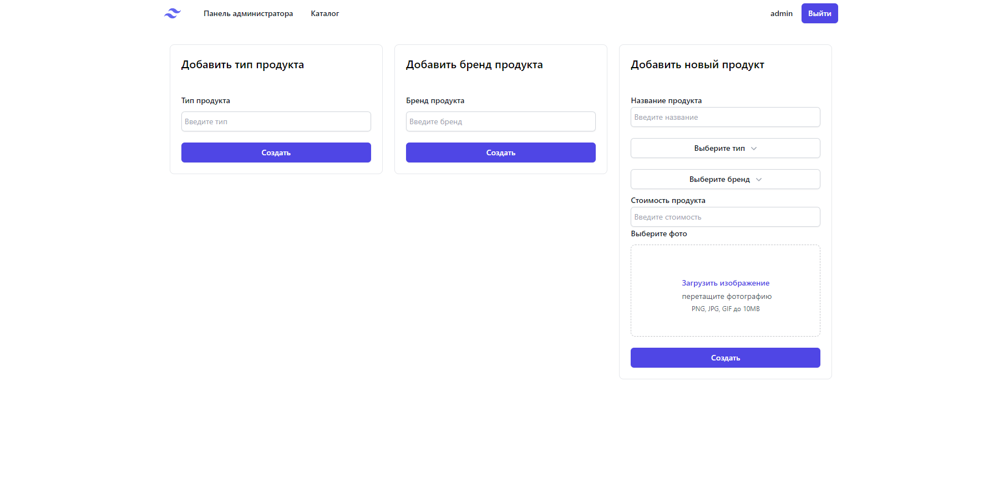

# 🛍️ Beauty Store - Online Cosmetics Shop

**Beauty Store** - это онлайн-магазин косметики, где пользователи могут просматривать каталог продуктов, добавлять товары в корзину, а администратор управляет типами, брендами и товарами. Проект построен с использованием **React**, **Redux Toolkit**, **React Hook Form**, **Tailwind CSS** и **Express.js**.

---

## 🌟 Основные функции

- 👥 **Авторизация и регистрация**: Пользователи могут регистрироваться и входить в систему с помощью JWT токена.
- 🔍 **Каталог продуктов**: Пользователи могут просматривать косметику по типам и брендам.
- 🛒 **Корзина**: Легко добавляйте товары в корзину и просматривайте их перед покупкой.
- 🔐 **Админ-панель**: Администратор может добавлять типы продуктов, бренды и сами продукты.
- 📦 **UI Kit**: В проекте разработан собственный UI Kit для стилизации элементов интерфейса с использованием **Tailwind CSS**.

---

## 📸 Демо

### Пользовательский интерфейс:

### Административная панель:

---

## 🚀 Технологии

- **Frontend - (client)**: 
  - React.js
  - Redux Toolkit - (client/src/store)
  - Tailwind CSS - (client/src/pages/Shop.jsx)
  - React Hook Form - (client/src/components/Admin)
  - UI Kit - (client/src/UIKit)

- **Backend - (server)**: 
  - Node.js 
  - Express.js - (shop/server)
  - PostgreSQL (для хранения данных)

---

## 🔧 Установка и запуск проекта

### 1. Клонирование репозитория

git clone https://github.com/irkaneprobirka/shop.git
cd shop

### 2. Импорт базы данных в pgAdmin
 - Откройте pgAdmin и подключитесь к вашему PostgreSQL серверу.
 - Создайте новую базу данных.
 - Выберите вашу базу данных, щёлкните правой кнопкой мыши и выберите Restore.
 - Укажите путь к файлу с дампом базы данных и нажмите Restore.

### 3. Установка зависимостей для Backend
 - Перейдите в директорию server:
    cd server
 - Установите все необходимые зависимости:
    npm install
 - Откройте файл .env в директории server и измените следующие переменные окружения:
     - DB_USER=your_postgres_user
     - DB_PASSWORD=your_postgres_password
     - DB_HOST=localhost
     - DB_PORT=5432
     - DB_NAME=your_database_name

 - Запустите сервер в режиме разработки:
    npm run dev
### 4. Установка зависимостей для Frontend
 - Перейдите в директорию client:
    cd client
 - Установите зависимости для фронтенда:
    npm install
 - Запустите React-приложение:
    npm run start
### 5. Открытие проекта
Откройте браузер и перейдите по адресу http://localhost:3000 для просмотра фронтенда.
Серверная часть будет доступна на http://localhost:5000.
